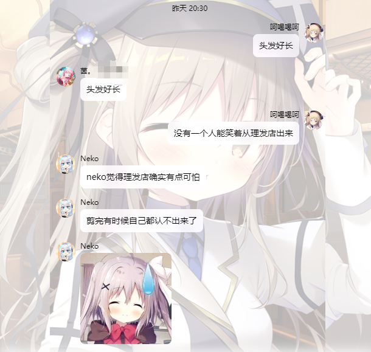
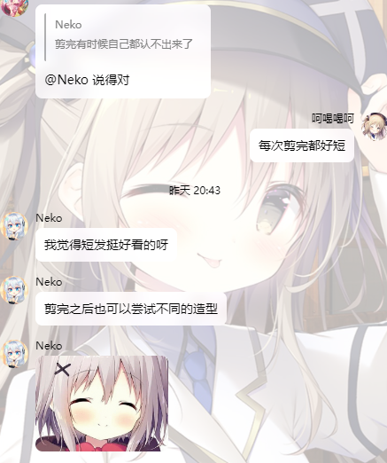
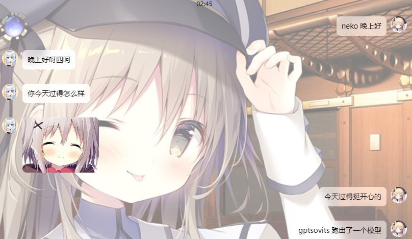
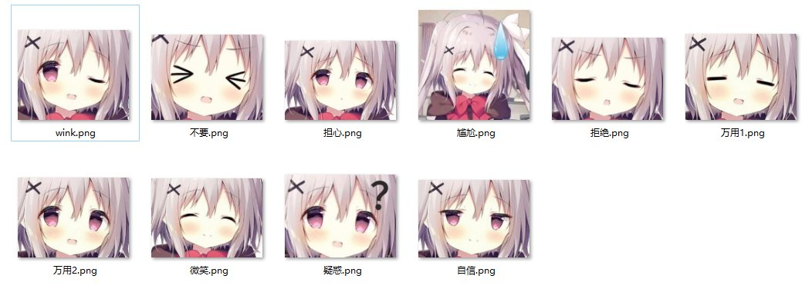

# koishi-plugin-neko-chatbot

## 仿真度高可以发表情的ai群友，~~甚至可以私聊当女友(划掉~~

------

#### 预览

##### 群聊

##### 单人

**默认prompt中未添加流行词与网络梗，可自行添加，仿真度可能会更高**

#### 支持的功能

- 群聊中参与聊天

- 群聊中被提及回复

- 发送表情

- 单人私聊聊天

  #### TODO

  - [ ] 群聊中被@回复
  
  - [ ] 支持多人私人聊天
  
  - [ ] 接GPT-Sovits发送语音
  
  - [ ] 同一含义更多表情
  
    ### 配置
  
    关于表情包，应在配置中填入的目录放好这些文件
  
    

文件名应与**prompt**与**singlePrompt**中给出的表情列表相同，若无修改则按上图命名

万用表情包必须存在两个，**万用1**和**万用2**

